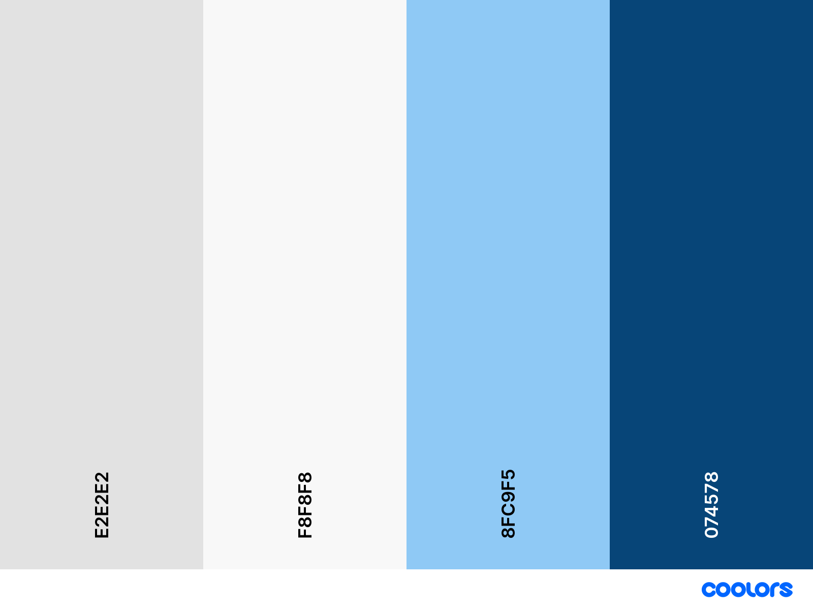

# ETECHER

For create a branch you need to call it like this example:

    etecher-yourGitUsername

Before you do a commit see your branch

    git branch

### Do small commits to make easier the project merge

---

If you want to do a commit you need to call it like:
    
    git commit -m "<type-of-commit>(etecher): fileName"

In the type of commit you must put some of those options: 

- feat: Add something new to the project.
- fix: Correct a bug that affect the code.
- perf: Changes that improve performance.
- docs: Documentation changes.
- refact: Refactor of the code that change names of functions or variables.
- style: Changes of the format like spaces, dots or commas
- test: Add tests.

### DON,T PUT _".", "..."_ OR _"etc..."_ IN THE COMMIT MESSAGE

---

## When you do a commit, inform to the rest
## Don't merge until all members are agree

---

## Etecher pallet color is:

